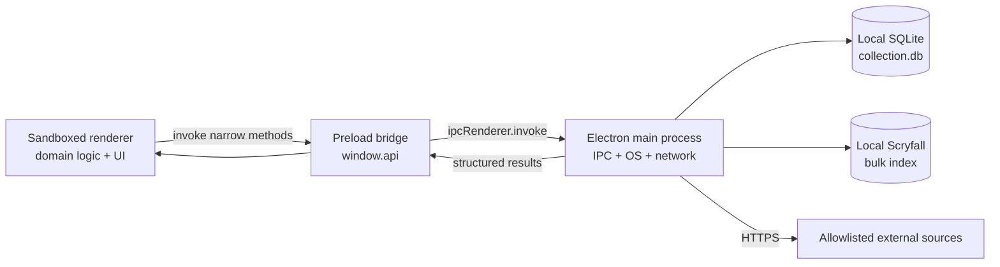

# Mana Ledger Backend Developer Guide

This document is an internal onboarding guide for developers working on Mana Ledger's data, persistence, integrations, automation, or Electron main-process code. It explains both **how the backend works** and **why it is shaped this way**.

Mana Ledger is a local-first Windows desktop application. It has no hosted application server, user account service, telemetry pipeline, or cloud database. In this repository, “backend” means a combination of:

- the Electron main process, which owns privileged operating-system access;
- the SQLite persistence layer;
- the narrow preload/IPC API exposed to the sandboxed renderer;
- renderer-side domain orchestration for imports, pricing, and catalog reconciliation;
- offline data-build scripts and GitHub Actions workflows.

That last distinction matters: a developer who reads only `src/main/` will understand the I/O layer, but not the full backend behavior. Much of the application-specific coordination still lives in `src/renderer-js/`.

This guide describes the repository at version 1.5.0. Code and schema remain the ultimate source of truth.

## 1. Ten-minute mental model

Mana Ledger has three runtime trust zones:



The renderer cannot use Node.js directly. `contextIsolation`, renderer sandboxing, a strict Content Security Policy, and a deliberately small `window.api` surface enforce that boundary.

The normal data path is:

1. The renderer loads domain state from SQLite through `window.api`.
2. User actions mutate the stable in-memory `collection` object.
3. `autoSave()` converts the renderer model into IPC calls.
4. Main-process IPC handlers call synchronous `better-sqlite3` functions.
5. External data is fetched in the main process and returned to the renderer for validation and domain reconciliation.
6. Generated catalog baselines are reviewed and committed; private user data never enters the repository.

The major design priorities are:

1. **Protect the collection.** It represents years of hand-curated user data.
2. **Remain useful offline and during upstream outages.** Baked data and last-known-good caches are intentional.
3. **Use exact identities.** Scryfall printing IDs, MTGJSON UUIDs, product IDs, and finish are preferred over name matching.
4. **Keep source semantics separate.** A market quote is not an owned item; a bonus-card possibility is not guaranteed product contents; a deck is not additional inventory.
5. **Fail soft at external boundaries, but fail loudly on invariant violations.** A source outage should preserve old data; a broken generated model should fail CI.

## 2. Technology and process boundaries

| Area | Technology | Responsibility |
|---|---|---|
| Desktop shell | Electron 42 | Process lifecycle, window, menu, dialogs, updater, filesystem access |
| Privileged backend | CommonJS Node.js in `src/main/` | SQLite, backups, bulk index, allowlisted network proxy |
| Persistence | SQLite via `better-sqlite3` | User state, price history, cached catalog data, settings |
| Security bridge | `src/preload.js` | Exposes narrow promise-based `window.api` namespaces |
| Domain orchestration | ES modules in `src/renderer-js/` | Imports, refresh workflows, reconciliation, in-memory state |
| Dashboard | Svelte 4 | Presentation over renderer-owned state and helper functions |
| Bundling | Vite 5 | Builds vanilla renderer modules and Svelte as two entries |
| Tests | Vitest plus smoke scripts | Pure logic, rendering seams, SQLite round trips, pipelines |
| Packaging | electron-builder | Windows NSIS installer and GitHub release assets |

### Why domain logic exists in the renderer

Mana Ledger grew from a client-side application. The June 2026 module split made the renderer modular without relocating all business logic. As a result:

- `src/main/` owns privileged capabilities and durable storage;
- `src/renderer-js/` owns most workflows and domain decisions;
- `src/preload.js` is the contract between them.

New code should preserve this separation. Pure domain functions may remain renderer modules when they have no privileged needs. Filesystem, SQLite, unrestricted process state, updater access, and network credentials belong behind IPC in the main process.

## 3. Repository map

```text
src/
├── main/
│   ├── main.js            Electron lifecycle, IPC, network allowlist, updater
│   ├── db.js              All SQLite access and migrations
│   ├── schema.sql         Fresh-database schema
│   ├── backups.js         Verified backup/list/restore operations
│   ├── bulkData.js        Scryfall default_cards download and compact index
│   └── precon-seed.json   Baked preconstructed-deck catalog
├── preload.js             contextBridge contract exposed as window.api
├── renderer/
│   ├── index.html         Shell and Content Security Policy
│   ├── styles.css         Shared visual tokens and styles
│   ├── secretlair.js      Generated baseline plus hand-maintained runtime code
│   ├── sl-price-seed.json Generated reviewed price-history seed
│   └── dist/              Vite output; never edit by hand
├── renderer-js/           Domain orchestration and most application screens
└── renderer-svelte/       Dashboard components and stores

scripts/
├── sl-build/              Shared Secret Lair baseline pipeline
├── precon-build/          Preconstructed-deck seed pipeline
├── smoke-*.js             Integration and regression smoke tests
├── db-recovery-*.js       Historical/diagnostic recovery tools
└── release.js             Version, changelog, tag, and push automation

test/                      Vitest tests for pure domain behavior
.github/workflows/
├── release.yml            Tag-triggered Windows release pipeline
└── secret-lair-data.yml   Scheduled shared-data maintenance pipeline
```

Other useful documents:

- `README.md` — user/product overview and common commands.
- `PROJECT_CONTEXT.md` — broad project handoff and historical decisions.
- `Secret Lair Data — Final Model.md` — authoritative source contracts and Secret Lair semantics.
- `RELEASING.md` — release operator runbook.
- `docs/local-intelligence.md` — boundaries of the optional offline inference feature.

## 4. Application startup and shutdown

The startup path lives in `src/main/main.js`.

1. A `--user-data-dir=<path>` argument may redirect the complete Electron profile. This is the safest way to test with an isolated database.
2. The app acquires a single-instance lock.
3. `db.init()` opens SQLite, configures pragmas, applies the fresh schema and idempotent migrations, and seeds precon data when needed.
4. `bulkData.init()` points the Scryfall bulk cache at the active user-data directory.
5. IPC handlers are registered.
6. The `BrowserWindow` is created with sandboxing, context isolation, and no Node integration.
7. Startup update checks and the verified daily backup are scheduled.
8. Renderer initialization loads catalog caches, then the private collection state.
9. On the first open of a calendar day, the renderer can refresh prices, Secret Lair data, and the precon catalog.

On shutdown, `db.close()` checkpoints the WAL with `wal_checkpoint(TRUNCATE)` and closes the database handle.

### Single-instance lock is a data-integrity feature

Do not remove `app.requestSingleInstanceLock()`. Two Mana Ledger processes previously wrote the same WAL database and produced malformed-database incidents. SQLite supports concurrency, but this application is intentionally a single-writer desktop process with renderer-owned mutable state. A second launch focuses the existing window instead of opening another database handle.

## 5. SQLite architecture

The live database path is derived from `app.getPath('userData')`; do not hardcode it. Existing installations use the historical profile location, commonly:

```text
%APPDATA%\secret-lair-tracker\collection.db
```

The product rename did not move existing data.

### Connection configuration

`db.init()` applies:

- `journal_mode = WAL` for durability and responsive reads;
- `foreign_keys = ON` for deck-card cascading behavior;
- `busy_timeout = 5000` rather than immediately failing on a transient lock;
- `synchronous = FULL` because collection durability is more important than shaving write latency.

The main process is the only runtime database owner. Renderer modules must never open SQLite directly.

### Schema overview

| Table | Ownership and purpose | Important identity/invariant |
|---|---|---|
| `cards` | Owned and sold card entries | One inventory entry per `id`; duplicate printings/copies are valid |
| `sealed` | Sealed, opened, and sold products | One product entry per `id`; may link to a Secret Lair drop/product |
| `want_list` | Desired cards and target prices | Small renderer-authoritative list |
| `price_history` | Daily printing/finish/source observations | PK `(scryfall_id, foil, date, source)` |
| `card_metadata` | Cached Scryfall characteristics | One row per exact Scryfall printing ID |
| `failed_lookups` | Latest refresh failures | Rebuilt wholesale each refresh |
| `sl_drop_cards` | Legacy drop-to-card-name projection | Derived compatibility data, not product truth |
| `sl_scryfall_drops` | Legacy printing-to-drop projection | Derived compatibility data |
| `sl_products` | Purchasable Secret Lair SKUs | One row per MTGJSON sealed-product UUID or synthetic fallback |
| `sl_product_cards` | Exact guaranteed product contents | Product, printing, finish, and count are all meaningful |
| `decks` | User-authored playable lists | Never counted as additional owned inventory |
| `deck_cards` | Cards/placeholders in a played deck | Cascades when its deck is deleted |
| `portfolio_snapshots` | One aggregate collection valuation per day | Last refresh of a date wins |
| `precon_decks` | Baked and appended precon catalog headers | Stable MTGJSON `fileName` key |
| `precon_deck_cards` | Exact precon membership | `(deck, printing, finish, board)` identity |
| `settings` | String key/value storage and JSON blobs | Values require caller-side parsing/versioning |
| `schema_version` | Initial schema marker | Currently not the migration driver |

Read `src/main/schema.sql` before modifying persistence. It is both executable schema and high-value domain documentation.

### Schema evolution

Fresh databases are created from `schema.sql`. Older databases are upgraded in `db.init()` with idempotent migrations. The current pattern is:

1. add the column/table/index to `schema.sql` for new installs;
2. add a guarded migration in `db.init()` for existing installs;
3. update row mapping in both directions;
4. add a real SQLite round-trip smoke test;
5. verify initialization twice against the same database to prove idempotence.

Many column migrations currently use `ALTER TABLE ... ADD COLUMN` inside `try/catch`, relying on SQLite to reject duplicate columns. The `price_history` source migration is a structured table rebuild because its primary key changed.

`schema_version` remains at version 1 and is not yet a comprehensive migration ledger. Do not assume incrementing it alone performs an upgrade.

### Write strategies are intentionally different

Do not normalize every feature to the same persistence strategy.

| Data | Strategy | Why |
|---|---|---|
| Cards | Bulk upsert | Large collection; normal imports merge and update without deleting absent rows |
| ManaBox-managed live cards | Transactional managed replacement | Explicit reconciliation removes only live ManaBox rows; manual cards and sold history survive |
| Sealed collection | Full transactional replacement | Small bounded list; deletion must be authoritative |
| Want list | Full transactional replacement | Small bounded list; simplest way to prevent stale rows |
| Deck | Upsert header plus replace that deck’s card rows | Deck lists are bounded and edited as a unit |
| Prices | Delta upsert | History grows forever; rewriting all history on every save is unacceptable |
| Failed lookups | Full replacement | Represents only the latest refresh result |
| Secret Lair model | Transactional replacement | The model is a reconciled snapshot and must not be half-updated |
| Precon catalog | Per-deck replacement/upsert | Printed decklists are immutable; live sync normally appends missing decks |

`autoSave()` uses `Promise.all()` over multiple IPC operations. Each database operation may be transactional internally, but the full autosave is **not one cross-operation SQLite transaction**. If a save partially fails, price deltas are restored to the pending queue for retry; other successful operations remain committed.

### JavaScript and SQL naming

- Renderer/domain objects use camelCase.
- SQLite uses snake_case.
- Conversion happens explicitly in `db.js` or `storage.js`.
- Scryfall IDs should be trimmed and lowercased at every entry point.
- JSON-valued columns/settings must be parsed defensively; corrupt optional caches should degrade to empty data, not prevent application startup.

## 6. Renderer state and persistence lifecycle

The renderer keeps a stable mutable `collection` object from `src/renderer-js/state.js`. It is mutated and not reassigned because Svelte, window globals, and many modules retain its object identity.

At startup, `autoLoad()` fetches cards, sealed products, decks, price histories, metadata, failures, settings, portfolio snapshots, and want-list rows in parallel. It converts SQL row names to the renderer model and loads several JSON settings blobs.

At save time, `autoSave()`:

- bulk-upserts cards;
- flushes only queued price snapshots;
- bulk-upserts metadata;
- replaces failures, sealed items, and the want list;
- stores general settings and Secret Lair intelligence overlays;
- upserts each deck.

Important JSON settings currently include:

- `settings_blob`;
- `sl_purchase_lots`;
- `sl_bonus_pulls`;
- `sl_watch_list`;
- `sl_market_quotes`;
- `insight_reports`;
- supplemental source caches and their timestamps;
- dashboard layout and local curation data.

Settings blobs are convenient for small, versionable, renderer-owned structures. Promote a blob to normalized tables when it becomes large, query-heavy, independently updated, or integrity-sensitive.

Manual JSON export is a portability/backup format, not the live persistence engine. Import merges into the existing collection unless the user resets first.

## 7. IPC and preload contract

`src/preload.js` exposes grouped methods under `window.api`:

| Namespace | Capability |
|---|---|
| `cards` | list, upsert, managed reconciliation, delete, ID repair, clear |
| `sealed` | list, upsert, delete, authoritative replacement, clear |
| `wantlist` | list and authoritative replacement |
| `decks` | list, per-deck upsert, delete, clear |
| `prices` | current/history reads, delta storage, complete load, clear |
| `portfolio` | daily snapshot record/list |
| `metadata` | bulk upsert/load/clear |
| `failures` | latest-set load/replace |
| `settings` | string key/value get/set/all |
| `sl` | replace/load reconciled Secret Lair model |
| `precons` | header list, lazy membership list, upsert |
| `bulk` | ensure Scryfall index, printing lookup, cheapest-by-name lookup, status |
| `backups` | list, create, restore, open folder |
| `dialog` | constrained file open/save operations |
| `net` | host-allowlisted HTTPS fetch |
| `app` | version/channel/path/backup health/external URL |
| `feedback` | optional relay status/send |
| `updater` | check/download/install and progress events |

### Adding an IPC capability

Use this sequence:

1. Put privileged implementation in `src/main/`.
2. Export a narrow function from the owning module.
3. Register one clearly named `ipcMain.handle()` entry in `main.js`.
4. Add the smallest useful wrapper to `preload.js`.
5. Validate type, shape, URL, or path again in the main process. Renderer validation is not a security boundary.
6. Return cloneable data only: plain objects, arrays, primitives, or explicit error objects.
7. Test the backend function without Electron where possible.
8. Restart Electron; changing main/preload code cannot be picked up by a renderer reload alone.

Avoid exposing a generic filesystem, shell-command, SQL, or arbitrary-fetch API. The preload bridge is deliberately capability-oriented.

## 8. Security and trust boundaries

### Renderer hardening

The `BrowserWindow` uses:

- `sandbox: true`;
- `contextIsolation: true`;
- `nodeIntegration: false`.

`src/renderer/index.html` defines a strict Content Security Policy. Scripts must come from the app itself; inline script and `eval` are not allowed. UI interaction is delegated through `data-act` attributes and `dispatch.js` rather than interpolated inline handlers.

The renderer still creates substantial HTML strings. Treat every imported or remote string as untrusted:

- sanitize import text at the CSV boundary;
- escape interpolated text with `esc()`;
- do not introduce inline event handlers;
- do not mark unsanitized remote content as Svelte `@html`;
- keep updater release-note sanitization intact.

### Network boundary

Renderer requests call `utils.netFetch()`, which invokes the main-process `net:fetch` handler. The main process:

- requires HTTPS;
- requires the hostname to be in `ALLOWED_FETCH_HOSTS`;
- supplies an application User-Agent;
- returns a small Response-like payload to the renderer.

Adding a source therefore requires both a conscious allowlist change and a parser/cache design. Never add a wildcard host or a renderer-side CORS proxy.

The Scryfall bulk engine is a deliberate exception to the generic proxy implementation: it is itself main-process code and uses Node's streaming `fetch` to avoid loading a roughly 500 MB source file into memory.

### Credentials

Optional PriceCharting and CardTrader tokens are local settings. They are sent only to their corresponding allowlisted first-party host. Do not log tokens, include them in generated reports, or move them into shared baseline assets.

The feedback relay key embedded in the application is public-by-design and can only target the configured inbox. Treat any future general-purpose secret differently; packaged Electron code cannot safely conceal a reusable server credential.

## 9. External data and source-of-truth rules

| Source | What Mana Ledger trusts it for | Cache/failure behavior |
|---|---|---|
| MTGJSON `SLD.json` | Product/content relational spine and identifiers | Keep baked/SQLite model if refresh fails |
| Scryfall | Exact printing metadata, images, finishes, and primary card prices | Keep prior bulk index; API fallback for misses |
| TCGCSV | TCGplayer market data and exact sealed product pricing | Keep previous values on partial/source failure |
| mtg.wiki Drop Series | Superdrop grouping, release semantics, MSRP, announced future rows | Replace only after a plausibility threshold |
| mtg.wiki Bonus Cards | Documented possible bonus inserts | Separate last-known-good enrichment cache |
| Wizards announcements | Sale timing and promotional context | Enrichment only; never product truth |
| PriceCharting | Optional user-requested sealed estimate | TCGCSV remains available and primary |
| CardTrader | Currency-preserving listing observations | Never silently merged into USD valuation |
| MTGJSON AllPrices | Reviewed compact Secret Lair history seed | Build-time workflow only; desktop never downloads the global payload |

### Exact identity beats names

The preferred join chain for Secret Lair is:

```text
MTGJSON sealed product UUID
  → deck/content reference
  → exact MTGJSON card UUID
  → exact Scryfall printing ID + finish
  → exact TCGplayer product ID for sealed pricing
```

Names are display values and fallback search keys. They are not stable product identity.

### Finish is part of identity

Secret Lair has both:

- separate foil and nonfoil Scryfall printings; and
- shared Scryfall printing IDs whose product entry carries the finish.

The runtime economic key is `(scryfallId, finish)`. Never infer ownership from card name alone, and do not discard MTGJSON `isFoil` information.

The foil-to-etched price fallback is intentional because many Secret Lair foil-like products only publish `usd_etched`.

### Semantic separation

- Bonus-card rows never affect guaranteed completion, missing-card lists, or crack value.
- Wizards articles do not set product MSRP because an article may mention multiple products, bundles, and shipping thresholds.
- Deck membership does not duplicate owned inventory value.
- Source currencies stay separate unless an explicit conversion model is introduced.
- Price observations are estimates, not guaranteed proceeds.

## 10. Scryfall bulk-data engine

`src/main/bulkData.js` replaces hundreds of rate-limited per-card requests with one daily download.

Flow:

1. Read the Scryfall bulk catalog.
2. Locate `default_cards`.
3. Stream the raw JSON file to disk.
4. Parse it line by line.
5. Retain only fields the application consumes.
6. Write `bulk/index.json` and `bulk/meta.json` under the user-data directory.
7. Load the compact index into a `Map` lazily.
8. Delete the raw download.

The freshness window is 20 hours. Concurrent `ensureFresh()` calls share one in-flight promise. If refresh fails but an old index exists, state returns to `ready` and the old index remains usable.

The renderer still falls back to Scryfall collection/search endpoints for missing IDs or a cold cache. This fallback is part of the resilience design, not obsolete duplication.

`cheapestByNames()` is an explicitly approximate facility used to estimate an unpriced printing from the cheapest available printing of the same card name. Keep it labeled as an estimate.

## 11. Secret Lair runtime and build pipelines

There are two related but different paths.

### Runtime refresh

The desktop fetches current MTGJSON SLD data, builds the finish-aware product model in `src/renderer-js/slData.js`, projects legacy maps, and persists the result through `sl.replace`.

It separately refreshes wiki grouping/MSRP, bonus data, and official announcements. Each supplemental source has an independent validation gate and cache so one source cannot erase another source's facts.

### Shared baked baseline

Fresh installs and offline sessions need a known-good baseline. The `scripts/sl-build/` pipeline produces it:

```powershell
node scripts\sl-build\fetch-sources.js
node scripts\sl-build\reconcile.js
node scripts\sl-build\emit-secretlair.js
node scripts\sl-build\smoke-secretlair.js
```

The larger price-history seed is separate:

```powershell
node scripts\sl-build\extract-price-seed.js
```

Pipeline responsibilities:

- `fetch-sources.js` downloads MTGJSON, Scryfall, and wiki inputs into ignored `cache/` files.
- `reconcile.js` produces canonical grouping and a human-review report in ignored `out/` files.
- `emit-secretlair.js` replaces generated literals in `src/renderer/secretlair.js` without rewriting its hand-maintained runtime functions.
- `smoke-secretlair.js` loads the generated file in a VM and enforces structural invariants.
- `extract-price-seed.js` streams MTGJSON AllPrices and emits only compact exact SLD history.

Do not manually edit generated data literals unless repairing the generator itself. Fix inputs, aliases, or reconciliation rules, then regenerate.

### Scheduled data workflow

`.github/workflows/secret-lair-data.yml` runs daily at `15:30 UTC` and can also be manually dispatched. It:

1. performs a clean install;
2. runs the shared-data build;
3. refreshes the large history seed on Sundays and manual runs;
4. runs unit tests;
5. uploads the reconciliation report;
6. pushes `automation/secret-lair-data` and opens or updates a reviewable PR only when generated assets changed.

This is scheduled data maintenance, not traditional change-triggered CI. It runs even when no code changed because upstream catalogs change independently. Repository Actions settings must permit GitHub Actions to create pull requests.

## 12. Precon catalog pipeline

Preconstructed decklists are treated as immutable reference data.

The baked path is:

```powershell
node scripts\precon-build\fetch-decks.js
node scripts\precon-build\resolve-tcg.js
node scripts\precon-build\emit-seed.js
```

- `fetch-decks.js` fetches the in-scope MTGJSON deck list and individual deck files.
- `resolve-tcg.js` resolves exact sealed TCGplayer product IDs when possible.
- `emit-seed.js` writes `src/main/precon-seed.json`.

`transformMtgjsonDeck()` in `src/renderer-js/preconData.js` is deliberately shared by the build and live paths so they cannot drift.

At runtime:

- headers load at startup;
- roughly 40,000 membership rows load lazily when needed;
- the app compares `DeckList.json` against stored stable filenames;
- only missing decks are fetched in ordinary synchronization;
- a newer baked seed version may correct/update existing rows without deleting live-synced decks that are not in the seed.

Keep the scope type list synchronized between the build script and `PRECON_SCOPE_TYPES`.

## 13. Price refresh and valuation flow

The renderer owns the refresh workflow in `src/renderer-js/prices.js`.

High-level sequence:

1. Build a unique set of printing IDs and required finishes from owned cards, deck cards, and want-list items.
2. Prefer the local Scryfall bulk index.
3. Batch unresolved IDs through Scryfall's collection API in groups of 75.
4. Apply rate-limit backoff and capture failures rather than aborting the whole collection.
5. Store Scryfall metadata and finish-aware daily prices in memory.
6. Fetch TCGCSV market observations where available.
7. Refresh sealed values and source caches.
8. Evaluate want-list/watch thresholds.
9. Record one aggregate portfolio snapshot for the day.
10. Queue price deltas and autosave.

Price history is source-separated:

- `scryfall` for primary printing-price observations;
- `tcgcsv` for market observations;
- `mtgjson-seed` for shipped historical points.

When building the in-memory Scryfall series, a live local point on the same date supersedes the seed point. Do not merge unlike sources into one silent “best” price.

Portfolio snapshots exist because reconstructing historical collection value from current ownership plus printing history has survivorship bias. Sold or removed cards would disappear from a retroactive reconstruction.

## 14. Backups, corruption handling, and recovery

Backups are a core backend subsystem, not an optional convenience.

### Daily backup guarantees

On launch, the app:

1. runs `PRAGMA integrity_check` on the live database;
2. refuses to back up or prune when the live database is corrupt;
3. copies the damaged DB/WAL/SHM to `backups/corrupt/` for diagnosis;
4. writes one dated backup if today's file does not exist;
5. verifies the new backup before trusting it;
6. prunes only after successful verification, keeping the newest 10.

This ordering prevents a corrupt daily copy from rolling the last good backup out of retention.

### Manual restore guarantees

`backups.restoreBackup()`:

1. accepts only a path inside the configured backup directory;
2. verifies the selected backup read-only;
3. closes and checkpoints the live DB;
4. moves the current DB, WAL, and SHM together into a timestamped `pre-restore/` directory;
5. copies the selected backup into place;
6. relaunches only after success.

Never restore a DB by copying only `collection.db` while a stale `collection.db-wal` remains beside it. SQLite may replay that WAL over the restored database.

### Recovery scripts

The `scripts/db-recovery-*.js` files document a previous forensic recovery. They are diagnostic examples with historical paths, not a generic one-command production tool. Preserve originals, operate on copies, open candidates read-only first, and run `integrity_check` before trusting recovered data.

For routine incidents, use the in-app verified restore workflow instead.

## 15. Development setup

### Prerequisites

- Windows 10 or 11;
- Git;
- Node.js 22 is the safest baseline for parity with CI and native prebuild availability;
- npm matching the lockfile expectations;
- Visual Studio C++ Build Tools only when a compatible `better-sqlite3` prebuild is unavailable;
- Windows Developer Mode for local electron-builder code-signing cache extraction.

PowerShell execution policy may block `npm.ps1`. Use `npm.cmd` and `npx.cmd` when that happens.

### Install and run

```powershell
npm.cmd ci
npm.cmd test
npm.cmd run build:renderer
npm.cmd run dev
```

`npm run dev` rebuilds the renderer and launches Electron with detached DevTools.

If the native SQLite module fails or reports an ABI mismatch:

```powershell
npm.cmd install --ignore-scripts
npx.cmd @electron/rebuild -f -w better-sqlite3
node node_modules\electron\install.js
```

The repository lockfile is a CI contract. When dependencies change, regenerate it, verify `npm ci` with the CI npm toolchains, and commit `package.json` and `package-lock.json` together.

### Never develop against the only live collection

Use an isolated profile:

```powershell
npm.cmd run build:renderer
npx.cmd electron . --dev --user-data-dir="C:\Temp\mana-ledger-dev-profile"
```

The redirect must be present before the Electron single-instance lock is acquired. It isolates the DB, backups, bulk index, settings, and lock from the installed application.

Use sample imports or a copied backup in the isolated profile. Do not point destructive tests or migration experiments at the user's production database.

### What requires rebuilding or restarting

| Change | Required action |
|---|---|
| `src/renderer-js/` or `src/renderer-svelte/` | `npm run build:renderer`, then renderer reload |
| `styles.css`, `index.html`, runtime part of `secretlair.js` | Renderer reload |
| `main.js`, `db.js`, `backups.js`, `bulkData.js`, `preload.js` | Full Electron restart |
| Native dependency or Electron version | Reinstall/rebuild native modules, then restart |
| Generated Secret Lair data | Run pipeline and smoke test, then reload/restart as appropriate |
| `precon-seed.json` | Restart with an isolated/fresh DB or bump seed version to exercise upgrade |

Do not edit `src/renderer/dist/` directly. It is overwritten by Vite.

## 16. Testing strategy

Mana Ledger deliberately uses several test layers.

### Unit tests

```powershell
npm.cmd test
```

Vitest runs pure renderer/domain logic in Node with browser globals stubbed by `test/setup.js`. Current coverage includes imports, acquisition, filtering, deck parsing, delegated dispatch, feature gates, insights, local intelligence, pricing contracts, search, Secret Lair modeling, and supplemental parsers.

### Renderer smoke suite

```powershell
npm.cmd run test:smoke
```

These scripts import real renderer modules with lightweight DOM stubs and exercise integration seams and render paths. They are intentionally broader and less isolated than unit tests.

### SQLite and data-critical smoke tests

Run the relevant scripts after persistence work:

```powershell
node scripts\smoke-backups.js
node scripts\smoke-backup-integrity.js
node scripts\smoke-sldata-db.js
node scripts\smoke-precon-db.js
node scripts\smoke-realized-db.js
node scripts\smoke-portfolio-db.js
node scripts\smoke-sealed-db.js
node scripts\smoke-decks-db.js
node scripts\smoke-wantlist-db.js
```

These create temporary databases and must never target the live profile. If the installed native module is currently rebuilt only for Electron, run them with the matching runtime as documented at the top of the individual script.

### Live/network smoke tests

Network tests are opt-in because they are slower and depend on external services:

```powershell
npx.cmd electron scripts\smoke-netfetch.js
node scripts\smoke-bulkdata.js --live
```

Do not repeatedly run large downloads or full Scryfall refreshes without reason.

### Production build check

```powershell
npm.cmd run build:renderer
```

The current build emits some known Svelte accessibility/unused-property warnings. New work should not introduce additional warnings, and errors must still fail the build.

### Minimum verification by change type

| Change | Minimum verification |
|---|---|
| Pure domain function | Focused Vitest test plus full `npm test` |
| Renderer workflow/rendering | Unit test where possible, relevant smoke, renderer build |
| SQLite schema/write path | Fresh DB, upgrade DB, idempotent re-init, relevant DB smoke |
| Backup/restore | Backup and integrity smoke tests; never use live data |
| IPC contract | Backend test, preload/main parity review, Electron launch |
| External parser | Fixture-based test, validation threshold, failure-preserves-cache test |
| Generated catalog | Full generator, report review, generated smoke test, diff review |
| Release/build config | Clean `npm ci`, tests, renderer build, inspect workflow/toolchain parity |

## 17. CI, scheduled maintenance, and releases

### Release workflow

`.github/workflows/release.yml` runs on `v*` tags or manual dispatch. It currently:

1. checks out on Windows;
2. configures Node 22 and the expected npm toolchain;
3. runs `npm ci`;
4. runs Vitest, renderer smoke tests, and database smoke tests;
5. builds the renderer;
6. builds and publishes the Windows installer;
7. updates the GitHub release body from `CHANGELOG.md`.

The default GitHub channel self-updates with `electron-updater`. Steam builds set `slChannel=steam` in packaged metadata and must not self-update because Steam owns file delivery.

### Release command

Before release, add user-facing notes under `[Unreleased]` in `CHANGELOG.md`, then run:

```powershell
npm.cmd run release:tag -- patch
# or: minor, major, or an explicit x.y.z
```

`scripts/release.js` requires a clean tree, bumps the version, promotes changelog notes, refreshes the lockfile, commits, tags, and pushes. The tag is the immutable input to release CI.

### Lockfile compatibility

Release CI and the scheduled data workflow do not necessarily start with the same bundled npm version. A lockfile accepted by a local warm `node_modules` tree may still be rejected by clean CI. Always test a clean install. The July 2026 failure was caused by a missing nested `esbuild` peer and platform packages that one npm toolchain tolerated while npm 10's `ci` correctly rejected the incomplete lock.

## 18. Common backend change recipes

### Add a persistent field

1. Add it to `schema.sql`.
2. Add an idempotent old-database migration.
3. Update insert/upsert column lists and parameter mapping in `db.js`.
4. Update load mapping in `storage.js` if renderer-visible.
5. Update export/import when the field belongs in manual backups.
6. Add a round-trip and restart/idempotence test.
7. Test an isolated copy of an older DB.

### Add a new persistent object type

1. Decide whether it is user-authored state, a rebuildable cache, or baked app data.
2. Choose normalized tables versus a settings JSON blob based on size and integrity needs.
3. Define transactional write semantics: merge, upsert, full replace, append-only, or delta.
4. Add `db.js` operations.
5. Add main IPC handlers and narrow preload methods.
6. Add renderer mapping and autosave/autoload integration.
7. Decide export, reset, backup, and migration behavior explicitly.
8. Add fresh/upgrade/round-trip/reset tests.

### Add an external source

1. Write down the source's exact authority. Do not add a source without a fact-level contract.
2. Prefer stable IDs over names.
3. Add the exact HTTPS hostname to the main-process allowlist.
4. Define response-size limits, validation gates, freshness, and last-known-good behavior.
5. Keep credentials local and host-scoped.
6. Add fixture-based parser tests.
7. Make failure preserve valid prior state.
8. Update attribution and user-facing data documentation.

### Change Secret Lair membership

1. Read `Secret Lair Data — Final Model.md`.
2. Reproduce the issue in `buildSlModel()` or the build pipeline.
3. Determine whether the problem is source data, aliasing, product traversal, finish inference, or a legacy projection.
4. Add a fixture/test for the applicable foil regime.
5. Regenerate shared assets only if the shared baseline changes.
6. Review the reconciliation report and generated diff.

### Change price logic

1. State which source and finish the value represents.
2. Preserve source-separated history.
3. Preserve the foil/etched fallback unless replacing it with a proven stronger rule.
4. Keep sold items out of owned value while retaining realized P&L.
5. Check portfolio snapshot behavior and want-list/watch evaluation.
6. Test both missing-price and partial-source cases.

## 19. Failure behavior and troubleshooting

### `npm ci` says package and lockfile are out of sync

- Regenerate with the CI-compatible npm toolchain.
- Inspect the diff for missing peer/optional platform packages.
- Test `npm ci` from a clean dependency tree.
- Commit the lockfile with the dependency change.
- Do not “fix” CI by replacing `npm ci` with `npm install`; clean reproducibility is the point.

### Electron cannot load `better-sqlite3`

- Confirm Node/Electron versions.
- Rebuild using `npm run rebuild` or `npx @electron/rebuild -f -w better-sqlite3`.
- If installation falls back to compilation, install the required C++ toolchain or use Node 22 with an available prebuild.

### Renderer changes do not appear

- Rebuild `src/renderer/dist` with `npm run build:renderer`.
- Confirm `index.html` loads the stable Vite output names.
- Reload the renderer; restart fully if preload/main changed.

### A new API host returns “Host not allowed”

- Add only the exact hostname to `ALLOWED_FETCH_HOSTS` after reviewing the source contract.
- Ensure it is HTTPS.
- Do not bypass the proxy with renderer `fetch` or a public CORS proxy.

### Secret Lair ownership appears wrong

- Confirm the exact Scryfall printing ID.
- Confirm normalized finish.
- Refresh Secret Lair data.
- Inspect `sl_products`/`sl_product_cards`, not only legacy drop maps.
- Check whether the source uses separate-printing or shared-printing foil semantics.

### Database integrity warning

- Stop experimenting on the live file.
- Preserve DB, WAL, and SHM together.
- Use the in-app backup list and verified restore.
- Inspect `backups/corrupt/` and `pre-restore/` if forensic work is necessary.
- Run `PRAGMA integrity_check` on copies before selecting a recovery source.

### Scheduled data workflow fails while no code changed

The workflow is supposed to run without code changes because MTGJSON, Scryfall, and wiki data change independently. Inspect the failed step:

- install failure means repository/toolchain state;
- fetch/parser failure may mean upstream availability or format drift;
- generated smoke failure means a data invariant changed;
- PR failure usually means repository token/policy configuration.

### GitHub reports Node action-runtime deprecation warnings

These warnings refer to the Node version embedded by an Action such as `actions/checkout`, not necessarily the Node version installed by `setup-node` for project commands. Update Action major versions after checking their release notes; do not confuse the warning with the project's runtime version.

## 20. Fragile invariants and anti-patterns

Treat these as code-review blockers unless the change deliberately replaces the underlying design:

- Do not run two app instances against one profile.
- Do not access SQLite from the renderer.
- Do not expose generic SQL/filesystem/shell capability through preload.
- Do not add arbitrary hosts or public CORS proxies.
- Do not log private API tokens or collection contents.
- Do not reassign the global `collection`, `ui`, or TCGCSV cache objects casually.
- Do not rewrite all price history during ordinary autosave.
- Do not treat a deck card as a second owned card.
- Do not infer exact products or finishes from names when stable IDs exist.
- Do not mix currencies or sources into an unlabeled price.
- Do not count documented bonus possibilities as guaranteed contents.
- Do not replace a good source cache with an implausibly small/empty parse.
- Do not edit generated Vite output.
- Do not hand-edit generated catalog data without fixing the generator.
- Do not copy a restored SQLite DB beside an unrelated stale WAL.
- Do not ship an installer from a dirty or untested tag.

## 21. Suggested onboarding path

A new backend developer can become productive with this sequence:

1. Read this guide and `README.md`.
2. Read `src/main/main.js`, `src/preload.js`, `src/main/db.js`, and `src/main/schema.sql` in that order.
3. Trace `src/renderer-js/storage.js` to understand the in-memory/durable boundary.
4. Trace one complete workflow, preferably price refresh or Secret Lair refresh.
5. Run unit tests, the renderer build, and one SQLite smoke test.
6. Launch an isolated development profile and import sample data.
7. Make a small pure-logic change with a focused Vitest test before touching persistence.
8. For Secret Lair work, read `Secret Lair Data — Final Model.md` before changing joins or finish semantics.
9. For release work, read `RELEASING.md` and inspect both GitHub workflows.

Before opening a pull request, answer these questions in the description:

- Which process owns the new behavior?
- Which source is authoritative for each new fact?
- What is the stable identity key?
- What happens when an external source is absent or malformed?
- Is the write a merge, replace, append, or delta?
- How does an old database upgrade?
- How is user data protected and recovered?
- Which tests prove the critical invariant?

## 22. Glossary

| Term | Meaning in Mana Ledger |
|---|---|
| Owned card | A `cards` row with `status='owned'` |
| Sold card | Retained historical row with proceeds/fees; excluded from current owned value |
| Printing | Exact Scryfall card ID, not merely a card name |
| Finish | Economic finish: nonfoil, foil, or etched; part of ownership identity |
| Drop | User-facing Secret Lair release grouping |
| SKU/product | Purchasable finish-specific sealed product |
| Product Truth | Exact guaranteed product contents derived from relational source data |
| Legacy projection | Name-keyed maps retained for older UI paths, derived from the product model |
| Baked baseline | Reviewed shared data committed with the application for offline/fresh-install use |
| Last-known-good cache | Previous validated source response retained when refresh fails |
| Price seed | Compact build-time historical data applied once per version |
| Portfolio snapshot | Aggregate daily value/cost point, not reconstructed from current holdings |
| Precon | Physical preconstructed deck catalog item, distinct from a user's played deck |

---

When in doubt, favor exact identity, explicit source labels, transactional replacement of coherent snapshots, and preservation of the last known good state. Mana Ledger's backend is small enough to understand end-to-end; the complexity comes from protecting user data and reconciling imperfect external catalogs without pretending those sources say more than they actually do.
