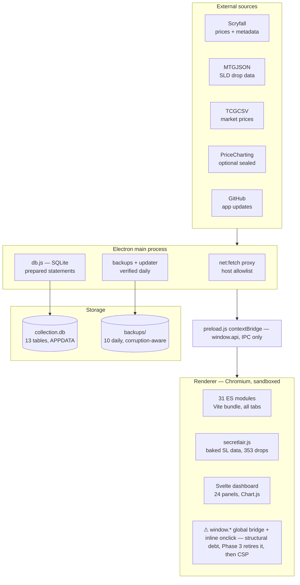

# Secret Lair Tracker — Full Project Overview
*Written 2026-07-02 at v0.27.0. A point-in-time assessment: what the app is, what it's good at, where it's weak, and where the leverage is.*

---

## TLDR

In eight weeks and 78 commits this went from nothing to something that has quietly crossed a category line — it started as "a collection tracker with Secret Lair features" and is now, as of the v0.23–0.27 run (Pro Instrument theme, left rail, Index, global search), a **financial terminal for a single MTG product line** — and nothing else in the ecosystem occupies that spot. Its defensibility is a curated dataset, not code. Its biggest strength is engineering judgment unusual for a hobby app; its biggest weakness is a renderer security surface that is actively growing while sitting directly in the path of the #1 roadmap feature. The single highest-leverage next move is Scryfall bulk data (tiny effort, deletes a whole failure category); the most *strategic* next move is community curation sync — but it must be preceded by hardening the SL tab's rendering, because it feeds untrusted text into exactly the sinks that haven't been fixed yet.

---

## What this actually is

A Windows Electron app tracking ~4,750 card entries / ~6,270 copies worth roughly $26k against an $18.5k cost basis, distributed to friends via GitHub Releases with a Discord-style in-app updater.

| Metric | Value |
|---|---|
| Age | ~8 weeks (first commit 2026-05-09) |
| Commits / active dev days | 78 / 14 |
| Releases shipped | 27 minor versions |
| Source (excl. deps/build output) | ~25,600 lines |
| Renderer modules / Svelte panels | 31 / 24 |
| Main process total | ~1,270 lines (main.js + db.js + schema) |
| Smoke-test scripts | 18 |
| SL dataset | 353 drops, 49 superdrops, rebuilt from 3 cross-validated sources |

The release cadence — roughly two shipped versions per active dev day — is the defining trait. Features go from idea to installed-on-friends'-machines in hours, and the CHANGELOG → release-notes → in-app "What's New" pipeline means releases are *legible*, not just frequent.

### Architecture

**The product thesis** (from REVIEW_AND_ROADMAP.md, worth holding onto): Moxfield, Archidekt, and ManaBox treat SLD as one flat set code. The *drop* as a unit of meaning — this card belongs to "City Styles," which shipped in April Superdrop 2022 at $29.99 — exists in no other tool's data model. And because Secret Lair is the only MTG product with a known purchase price and a knowable current value, it's the only product where per-purchase P&L is naturally computable. Drop P&L, crack-or-keep, the SL Index, and completion tracking all fall out of that one insight. The app now answers *"has Secret Lair actually paid off for me?"* — a question with no other answer on the internet.

---

## Strengths

1. **The data asset is a real moat.** The `scripts/sl-build/` pipeline reconciling MTGJSON (membership + collector numbers), Scryfall (dates), and mtg.wiki (superdrop grouping — which exists *nowhere* in machine-readable form) is tedious, ongoing curation nobody else does. Software is copyable; a maintained dataset isn't. The foil→etched price fallback and collector-number backfill are the same species of advantage — accumulated domain corrections a competitor would have to rediscover one bug at a time.

2. **Electron hygiene most commercial apps don't have.** Sandboxed renderer, context isolation, no node integration, every external HTTP call routed through a main-process proxy with a host allowlist, prepared statements and transactions throughout, single-instance lock, WAL checkpoint on clean quit. The trust boundary is real, not decorative.

3. **Operational empathy.** The Failed Lookups tab distinguishes batch errors from not-found from no-price and offers targeted retry. Rate limiting backs off with user-visible countdowns. The activity log has categories. This is the texture of software whose author actually uses it daily and fixes what hurts.

4. **It learns from its failures — properly.** The DB corruption arc: two incidents, a real root cause (two instances writing one WAL file), a correct fix (instance lock + clean close + `synchronous=FULL`), *and* defense in depth (integrity check before backup, quarantine of corrupt files, verify-before-prune so a bad copy can never rotate out a good one).

5. **Institutional memory.** PROJECT_CONTEXT, REVIEW_AND_ROADMAP with session handoffs, changelog discipline, auto-memory. A cold session can be productive in minutes. This is why the velocity is sustainable rather than chaotic.

6. **Scope discipline.** "Decks is feature-complete." No cloud, no accounts, no scanning, no social. Local-first single-file SQLite framed as a *feature*. Saying no is the rarest strength on this list.

---

## Weaknesses

1. **The renderer's security surface — and it's growing.** Dozens of `innerHTML` sinks and inline `onclick` handlers fed by CSV/Scryfall/MTGJSON/TCGCSV data, guarded by an `esc()`/`escJs()` pattern that *fails open*: one missed escape means arbitrary JS with full `window.api` access, including `data:reset`. No CSP, because inline handlers preclude one. Every recent feature (SL editor, want list, search) has added handlers to this surface. Tolerable in a private app — but the friend-sharing model already makes a malicious shared CSV a real vector, and roadmap item #1 (community curation) imports *untrusted text from strangers* straight into these sinks. The debt and the roadmap are on a collision course.

2. **No unit tests; Phase 2 has been "next" since June 12.** The 18 smoke scripts are genuinely good (they import real modules), but they're hand-rolled, not in CI, and don't cover the most regression-prone pure logic: CSV mapping, deck parsing, the price-fallback ladder, format legality, the search matcher regexes. At this velocity, this is the gap most likely to bite.

3. **The memory-mirror data model has a ceiling.** The entire collection is one mutable JS object; SQLite is largely a serialization target, with wholesale replace-saves for sealed and want list. At 6k copies this is snappy, and delta price saves fixed the worst of the mirror tax. But every feature adds pressure, and the day a friend imports a 50,000-card ManaBox export, the architecture gets stress-tested involuntarily.

4. **Velocity is producing consistency cracks.** Search tabs persist to `localStorage` while every other preference lives in SQLite settings. PROJECT_CONTEXT still describes the retired top-tab layout and says "0.15.x" — twelve versions behind. `secretlair.js` is a 7,500-line classic script holding the crown-jewel dataset as baked globals while parallel `sl_*` SQLite tables exist — two sources of truth stitched at runtime. None of these are bugs; all are interest accruing.

5. **Bus factor of one, platform of one.** Windows-only, one maintainer, no first-run onboarding for the friends who install it. The distribution model exists, but the front door is unfinished.

---

## Where it goes next — ranked by leverage

1. **Scryfall bulk data — best value-per-line in the backlog.** One daily `default-cards` download through the existing `net:fetch` proxy gives every price with zero rate limits. Deletes the entire 429/backoff/batch-retry category, makes full refreshes near-instant, and makes the v0.26 live search and printings tabs dramatically cheaper. This item's value has *risen* while it sat unbuilt.

2. **Community curation sync, gated behind hardening the SL tab.** The strategic feature — `sl_overrides` export/import becomes a GitHub-hosted canonical SL dataset the app syncs like MTGJSON, and the app stops competing with Moxfield and becomes the reference tool for a product line WotC ships forty times a year. But sequence it: migrate the SL tab's rendering off inline handlers *first* (this changes the old Phase 3 advice of "Decks or Sealed first" — the strategic pick is now slTab, because it's the tab that will render strangers' text), then ship Phase A export/import, then hosted sync. Phase A alone is small and immediately useful to friends.

3. **Alerts + collection report.** Route want-list threshold hits to native OS notifications; add a `printToPDF` insurance/year-end report. Thin layers over existing plumbing, and alerts change the app's relationship with the user — it starts coming to *you*.

4. **Local Vault, in two phases.** The hub popover (DB location, size, last backup, backup-now/export/reset actions) is cheap and genuinely useful — do it soon. Multi-vault is the risky half: it touches the exact single-instance/clean-shutdown invariants that caused the corruption incidents. Phase it deliberately.

5. **The v1.0 hardening bundle.** Vitest on pure modules (start with the search matcher and CSV mapping — newest and most intricate), CSP once inline handlers are gone, first-run onboarding. Plus two hours of housekeeping: bring PROJECT_CONTEXT current, move search-tab persistence into settings.

**The strategic read:** every remaining roadmap item is outward-facing — community data, notifications, reports, onboarding. The app's center of gravity is shifting from *features for you* to *the dataset and who else trusts it*. That's exactly the right direction, and it's why the security debt, a footnote when this was a private tool, is now the first domino in the critical path. Ship the bulk-data quick win, harden the SL tab, then go claim the moat.
